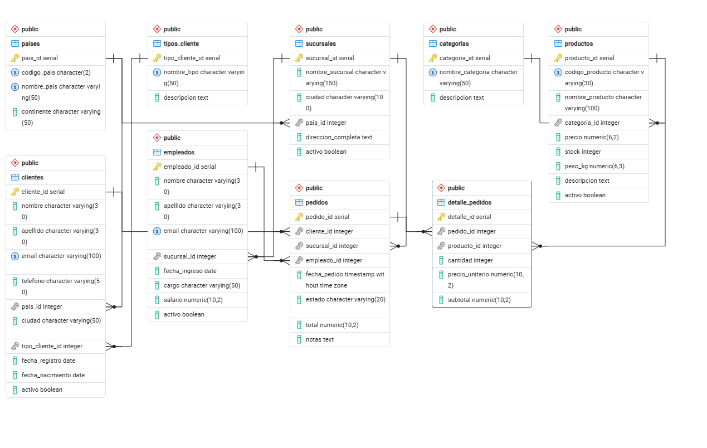
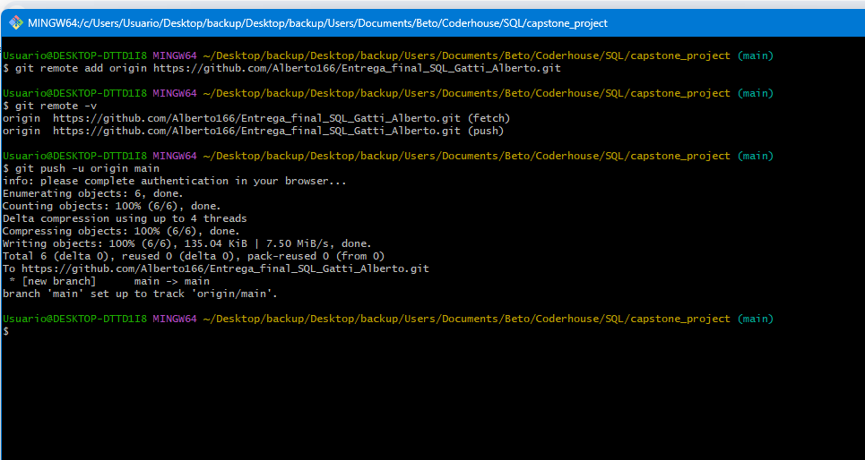

# Capstone Project: Análisis Exploratorio de Datos (EDA)
**Diplomatura en Data Science - Materia_SQL**  
**Desarrollado por:** Alberto Fabian Gatti

---

## 1. Descripción del Problema de Negocio
El presente proyecto simula el flujo de trabajo de un analista de datos dentro de una organización transaccional orientada al comercio electrónico. La dirección requiere visibilidad clara sobre el comportamiento de sus clientes VIP, la estacionalidad de la facturación mensual, la detección de productos de baja rotación ("inventario muerto") y el liderazgo de ventas interno por cada categoría.

Para resolver esto, se diseñó e implementó una base de datos relacional robusta en **PostgreSQL** (`capstone_project`) compuesta por 9 tablas interconectadas que controlan la geografía, la estructura organizacional, el catálogo de productos y el flujo transaccional de pedidos.

### Modelo Entidad-Relación (Diagrama de Base de Datos)
Para dar soporte analítico a la operación, se estructuró un modelo relacional normalizado que garantiza la integridad referencial de los datos. A continuación se presenta el mapa de arquitectura del esquema generado desde PgAdmin:



---

## 2. Hallazgos Principales y Conclusiones Ejecutivas

Tras ejecutar el Análisis Exploratorio de Datos (`analisis.sql`), se extrajeron los siguientes insights estratégicos para el equipo directivo:

**Calidad de Datos y Limpieza (`COALESCE`):
** Se realizó una auditoría de calidad mediante consultas de control para dimensionar el volumen de valores nulos en el dataset.
  
```sql
SELECT 
    COUNT(*) - COUNT(empleado_id) AS nulos_en_empleado,
    COUNT(*) - COUNT(notas) AS nulos_en_notas
FROM pedidos;
```
  
**Resultado de la consulta:** `nulos_en_empleado = 0` y `nulos_en_notas = 200`.  
*Interpretación:* La auditoría confirmó que el 100% de los pedidos tienen un empleado asignado (operación asistida). Sin embargo, se detectaron exactamente 200 registros con notas vacías. Mediante la aplicación de `COALESCE`, se estandarizaron estos vacíos transformándolos en el texto *"Sin observaciones comerciales"*, garantizando reportes limpios, homogéneos y profesionales para la gerencia.

** Se realizó una auditoria consultando si existian productos con stock nulos

 ```sql
 SELECT 
    COUNT(*) - COUNT(stock) AS productos_con_stock_nulo
 FROM productos;
 ```
 **Resultado de la consulta: `productos_con_stock_nulo = 0`
 *Interpretación:* La auditoría confirmó que ningun producto tiene stock nulo.
 Se aplicó de manera preventiva ```COALESCE(stock, 0)```en la seccion de limpieza, tratamiento de nulos. Aunque la auditoría del dataset actual muestra cero nulos en stock , el uso de COALESCE actúa como una regla de negocio y un escudo de calidad. Si el día de mañana el área de Compras carga un producto nuevo y olvida especificar el stock, la base de datos no va a fallar ni va a romper los reportes comerciales; automáticamente asumirá que hay 0 unidades disponibles hasta que se regularice".

* **Auditoría de Tipos de Datos:** Se verificó mediante los metadatos de PostgreSQL que las columnas críticas cumplan con los estándares necesarios:
  * `fecha_nacimiento` y `fecha_registro` ➡️ **`DATE`**: Permite calcular edades, segmentar por rangos etarios o medir el tiempo de vida del cliente de forma nativa.
  * `fecha_pedido` ➡️ **`TIMESTAMP WITHOUT TIME ZONE`**: Almacena fecha y hora exacta de la transacción, permitiendo agrupaciones temporales precisas mediante `TO_CHAR`.
  * `total` y `precio` ➡️ **`NUMERIC`**: Garantiza precisión exacta en centavos, cumpliendo la regla de no usar datos aproximados (como FLOAT) en entornos financieros para proteger la contabilidad del negocio.

* **Concentración de Clientes VIP (Top 5):** **Verónica Torres** es la cliente de mayor valor para la empresa, generando una facturación histórica de **21,945.47** en solo 3 pedidos. Por otro lado, **Claudia Rodríguez** demostró la mayor fidelidad con 4 pedidos acumulados. Estos perfiles deben ser priorizados por Marketing para campañas de retención exclusivas.

* **Estacionalidad Temporal (Análisis de Ventas Mensuales):** Se detectó un pico histórico récord en **Febrero de 2024 (28,764.32)** y un fuerte impacto comercial en **Noviembre de 2023 (22,125.34)**. 
  
  *Análisis Técnico-Comercial:* Los datos muestran una anomalía positiva en noviembre de 2023: la facturación se eleva y el ticket promedio bate el récord de ese año (`2,765.67`). Cruzando este comportamiento con el conocimiento del mercado de este rubro, deducimos que el negocio se acopló con éxito a la estacionalidad de alta conversión de **Cyber Monday y Black Friday**, traccionando la venta de artículos de alto valor que inflaron el ticket promedio. Al ver que en noviembre de 2024 la facturación cayó a menos de la mitad (`10,639.58`), confirmamos que la estrategia comercial de ese año no tuvo el mismo impacto o no se ejecutó con la misma fuerza promocional. El negocio sufre "bajas" profundas de consumo posteriores (como Diciembre de 2023 o Abril de 2024), indicando la necesidad de implementar promociones reactivas estacionales.

* **Eficiencia de Inventario (Baja Rotación):** El análisis alertó sobre capital inmovilizado en la categoría *Ropa y Calzado*. Los productos menos vendidos de la tienda son la **Remera Polo Ralph Lauren (16 unidades)** y la **Campera The North Face (18 unidades)**. Se sugiere al área comercial aplicar estrategias de liquidación o combos promocionales para liberar almacenamiento.

* **Liderazgo Comercial por Categorías (`RANK`):** Mediante funciones de ventana, se descubrió que el volumen del negocio está traccionado fuertemente por productos masivos como los **Hot Wheels Pack de 20 (62 unidades)** en Juguetes, el **Café de Etiopía (65 unidades)** en Alimentación y las **Botas Timberland Classic (49 unidades)** en Ropa. Estos artículos deben ser utilizados como "productos gancho" en la portada de la plataforma digital.


---

## 3. Instrucciones de Ejecución del Código

### Paso 1: Clonar el Repositorio Localmente
Abra su terminal de Git Bash y ejecute:
```bash
git clone https://github.com
cd Entrega_final_SQL_Gatti_Alberto

```

### Paso 2: Despliegue de la Estructura y Carga
1. Cree la base de datos `capstone_project` en PostgreSQL.
2. Desde el Query Tool de PgAdmin, abra y ejecute el archivo `estructura.sql` (`F5`).
3. *Nota:* Los comandos `COPY` están configurados para la ruta local `C:\Archivos_csv_proyecto_final_sql\`. El script incluye la resincronización automática de contadores `SERIAL` post-carga para prevenir errores de clave duplicada.

### Paso 3: Análisis Exploratorio (EDA)
Abra el archivo `analisis.sql` en PgAdmin y ejecute las consultas para observar el comportamiento de las métricas de limpieza y los 4 bloques analíticos ejecutivos.

---

## 4. Evidencia de Uso de Git y Control de Versiones
Para garantizar las buenas prácticas de desarrollo y el control de versiones del proyecto, se utilizó la terminal de **Git Bash** para la gestión del repositorio local y su posterior sincronización con el entorno remoto en GitHub.

A continuación, se adjunta la captura que evidencia el flujo de trabajo con los comandos ejecutados (`git add`, `git commit`, `git push`):



